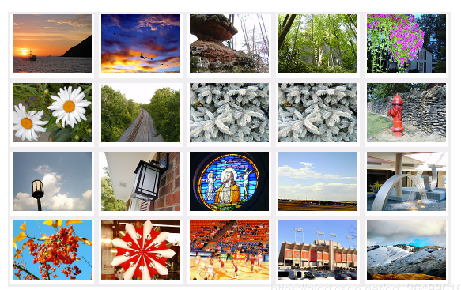
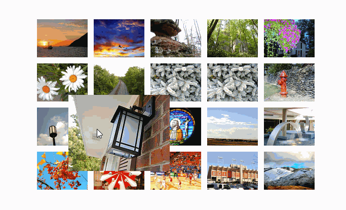

# 每日作业 - css第六天

## 1、第一题，简答题

从定位的参照物以及是否占位置，总结一下，相对定位，绝对定位和固定定位的区别

## 2、第二题：案例练习

**需求：新浪网页两侧固定的广告**

#### 新浪案例分析

1. 左右两侧的广告图片**固定**在浏览器可视窗口的左右两侧，不会随窗口一起滚动，并且要贴着版心的边缘；

   

## 3、第三题：案例练习

### 需求描述：

​	定位实现鼠标滑过图片等比例放大，显示在原尺寸图片的上方。

### 起始状态

### 实现状态

