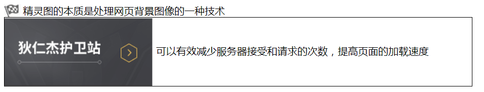

# 每日作业 - css第七天

## 1、第一题，简答题

总结今天总结的css初始化的代码，这些是写页面都需要使用的。

这些代码不需要我们背，我们只需要知道这些代码是什么意思。（熟悉）

## 2、第二题：案例练习

**需求**：购物车和登录图标切换，（**精灵图的使用**）

#### 新浪案例分析

1. 页面加载，显示的是购物车的图片，当页面加载的时候，显示“登陆”，
2. 注意：这里使用的同一张背景图；

## 3、第三题：案例练习

### 需求描述

​	如下图,王者荣耀官网的一张精灵图:

### 案例效果

